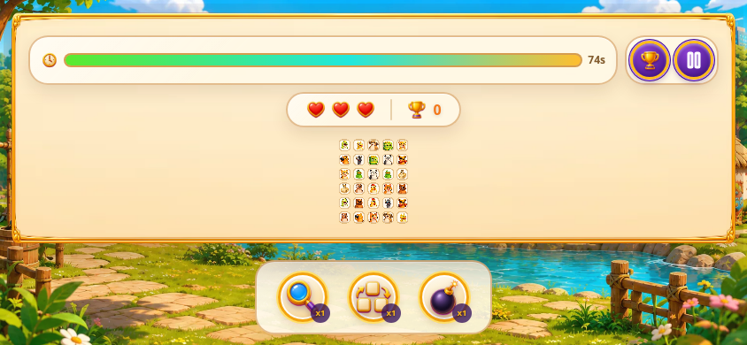
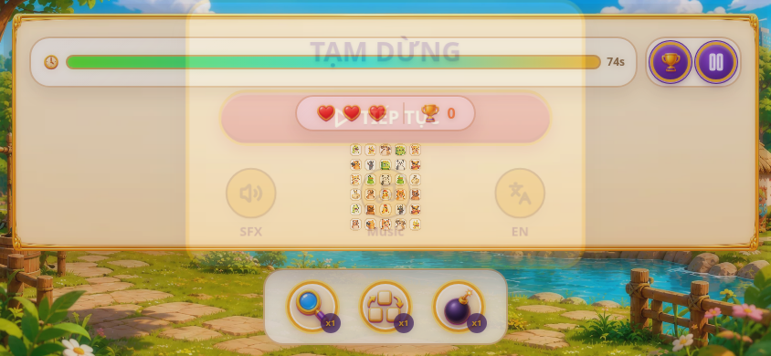
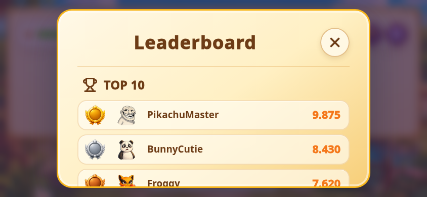
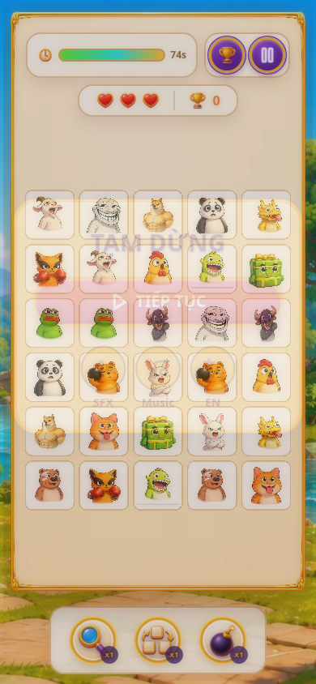
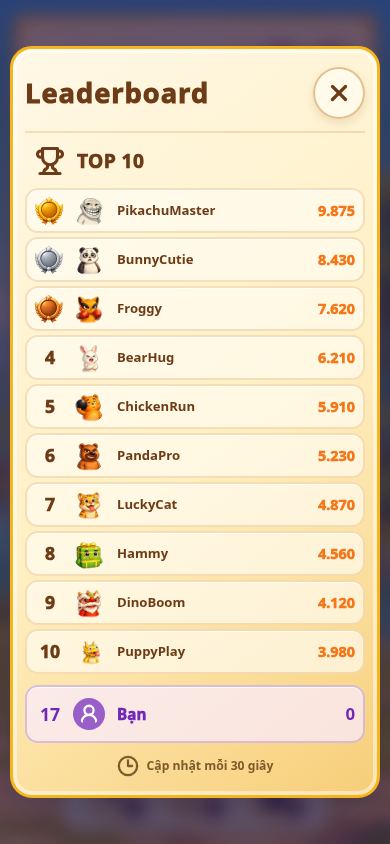

# 02 — Phát hiện, bằng chứng và mức độ

Mức độ dưới đây xếp theo rủi ro của hành vi game, không phải theo độ dễ sửa.

| ID | Mức độ | Trạng thái | Phát hiện |
| --- | --- | --- | --- |
| P0-01 | P0 | Source confirmed | Wink pause/mute lifecycle chưa được nối vào Game và audio thực tế |
| P1-01 | P1 | Source confirmed | Pause chỉ chặn input/timer, callback match đang chờ vẫn có thể thực thi |
| P1-02 | P1 | Source + Chromium runtime | Audio không có policy hidden/blur/focus và BGM bị request trước trusted gesture |
| P1-03 | P1 | Chromium runtime | Layout mobile ngang 844 x 390 làm board, Settings và Dashboard không sử dụng được |
| P1-04 | P1 | Source + Chromium runtime | Dashboard/Settings không đồng nhất UI; Dashboard English bị trộn fallback Vietnamese |
| P2-01 | P2 | Source confirmed | Leaderboard tĩnh nhưng copy thông báo refresh 30 giây |
| P2-02 | P2 | Source confirmed | Manifest Wink nhắc hai integration files không có trong checkout |
| P3-01 | P3 | Source confirmed / candidate | Dead code, duplicate CSS owner và generated artifacts cần được xét sau khi fix hành vi |

## P0-01 — Host lifecycle không vào game

**Symptom mong muốn:** Khi parent/host pause, game dừng đúng contract: board/input/timers/scheduled gameplay callbacks dừng, round không reset. Khi host mute, output BGM/SFX im nhưng user preference vẫn được nhớ. Resume/unmute phục hồi đúng theo preference và trạng thái game.

**Actual [A]:** wink-bridge.ts và client.ts có định nghĩa lifecycle API, nhưng Game không bind. Import graph cho thấy winkGame hiện chỉ được dùng nội bộ client/tests.

**Immediate cause [A]:** Không có integration owner tạo hostPaused/parentMuted và truyền chúng vào Game, usePairMatchGame, useGameAudio.

**System cause [C]:** Contract host tồn tại ở adapter, còn owner gameplay/audio vẫn tự vận hành theo modal local. Hai hệ state không gặp nhau.

**Root cause [C]:** Integration được định nghĩa/test ở lớp library nhưng chưa được compose ở application root.

**Hướng sửa [D]:** Tạo một integration owner nhỏ tại app root; nó chỉ chuyển lifecycle host thành state, không đặt business rule game vào bridge. Tính effective pause theo OR của modal, host pause và background. Tính effective audibility theo user preference và forced conditions.

## P1-01 — Pause không đóng băng transition đang chờ

**Expected:** Bấm pause trong khoảng animation/match không được làm board, điểm, selection, clear state thay đổi phía sau modal.

**Actual [A]:** usePairMatchGame.ts dừng interval và guard input theo isPaused, nhưng scheduleForCurrentRun dùng raw setTimeout. Callback có thao tác remove match, cập nhật score, clear selection và continuation mà không kiểm tra/báo pause.

~~~text
click ở thẻ thứ nhất + thẻ thứ hai
  -> schedule callback 400/700 ms
  -> user mở Pause
  -> timer countdown dừng, input bị chặn
  -> callback đã tạo vẫn có thể mutate game state
~~~

**State owner:** usePairMatchGame.ts.  
**Lifecycle owner hiện tại:** không đầy đủ; modal owner ở Game.tsx, scheduler owner ở hook.

**Hướng sửa [D]:** Một scheduler có thể freeze/resume theo effective pause, hoặc callback được gate để chỉ commit khi run còn hợp lệ và game đang unpaused. Lựa chọn cuối phải giữ đúng duration game; không cancel callback rồi bỏ luôn transition. Test cần bao gồm pause giữa match và resume.

## P1-02 — First gesture và background audio chưa có policy

**Expected:** Không BGM/SFX nào tự phát trước first trusted interaction. First pointer/touch hoặc key hợp lệ sẽ unlock audio và bật BGM nếu user đã bật music. Khi page hidden/window blur/host pause, BGM và SFX im ngay. Khi quay lại, game hiện Pause và chỉ resume BGM sau Continue từ gesture.

**Actual [A]:**

- Mount useGameAudio gọi toggleBgm(musicEnabled && !parentMuted).
- toggleBgm(true) gọi Howl.play(); điều này không đảm bảo nằm trong trusted interaction.
- Global pointerdown/keydown chỉ unlock context; không có listener visibilitychange, blur, focus.
- Audio state không biết hostPaused hay document.hidden.
- muteAll/unmuteAll không có caller trong live game.

**Runtime observation [A]:** Chromium local đã ghi console warning:

~~~text
HTML5 Audio pool exhausted, returning potentially locked audio object.
~~~

Warning xuất hiện trong runtime 390 x 844. BGM hiện dùng html5: true. Đây là bằng chứng cần điều tra, không phải bằng chứng tái hiện lỗi âm thanh trên Safari/iPhone.

**Immediate cause [A]:** BGM request ở mount và không có effective policy state tập trung.

**System cause [C]:** User setting, host mute/pause, browser lifecycle và unlock là các state riêng lẻ; code không có một predicate xác định khi nào audio được phép phát.

**Root cause [C]:** Lifecycle policy chưa có owner. Đây không chỉ là lỗi của một play call.

**Hướng sửa [D]:**

1. Giữ audio.ts là implementation owner của Howler, thêm state policy tối thiểu: user music, user SFX, parent mute, effective pause/hidden, đã unlock, BGM requested.
2. useGameAudio chỉ compose application state vào policy và chỉ đăng ký một first-gesture listener capture an toàn.
3. BGM preload được phép, nhưng không play ở mount.
4. First gesture hợp lệ gọi unlock và sync policy ngay trong gesture. Nếu user đã turn off music thì vẫn unlock cho SFX nhưng không bật BGM.
5. Hidden/blur/host pause phải pause BGM, suppress SFX; focus không tự động play khi chưa có explicit resume UX.
6. Pause overlay thêm lý do “Đã tạm dừng khi bạn rời khỏi game” nếu return từ background; Continue là trusted gesture để sync/resume.
7. Chỉ quyết định giữ html5: true, đổi mode, hay dùng event playerror/unlock sau khi nghe trên Safari thực. Không tăng HTML5 pool để che warning.

## P1-03 — Responsive landscape ngắn bị vỡ

### Bằng chứng runtime Chromium

| Viewport | Quan sát DOM | Kết luận |
| --- | --- | --- |
| 390 x 844 | Board 342 x 560; Settings 370.93 x 300.47; Dashboard 370 x 752/list 340 x 486 | Hiện tại dùng được, không root overflow |
| 844 x 390 | Board 796 x **106**; Settings y = **-8.07**; Dashboard list cao 490 trong shell cao 354, scrollHeight 672 | Board quá ngắn; Settings bị cắt đầu; Dashboard content bị che |

**Immediate cause [A]:** CSS chỉ có mobile treatment đến 1023 px, không có short-landscape branch. Header hai hàng, rail stat và bottom power-ups ăn phần lớn chiều cao. PauseOverlay truyền offsetTop, làm modal dịch lên. Dashboard outer overflow hidden trong khi list giữ max-height lớn.

**Hướng sửa [D]:** Thêm media query ngắn + ngang scoped max-width 1023px, orientation landscape, max-height 600px. Compact HUD thành một hàng/hide secondary metadata, giảm control rail, dành diện tích còn lại cho board. Đặt dashboard content flex column trong max-height calc(100dvh - safe padding), min-height 0, chỉ list scroll. Bỏ offsetTop hoặc chỉ dùng nó khi viewport đủ cao.

**Acceptance đề xuất [D]:** ở 844 x 390, board cao tối thiểu 240 px hoặc kích thước tile đọc được/tương tác được qua review visual; không modal nào có top/bottom nằm ngoài viewport; leaderboard list scroll được và close button luôn thấy.

## P1-04 — UI và i18n Dashboard/Settings không đồng nhất

**Actual [A]:**

- Settings dùng HyperModal, purple/violet surface, gold outline, pink primary button.
- Dashboard dùng dashboard-shell cream/nâu, background và close control riêng.
- Dashboard resource English có “Leaderboard”, nhưng nhiều fallback chưa có key i18n giữ chuỗi Vietnamese.

**System cause [C]:** Dashboard được build như một hệ shell riêng dù có cùng vai trò modal overlay với Settings. i18n resource không được xem như source of truth của tất cả UI string.

**Hướng sửa [D]:** Dùng Hyper UI hiện có làm shell/modal/button grammar chung. Dashboard có thể thêm content class scoped để giữ leaderboard layout, nhưng không tạo system mới. Đầy đủ key cho cả en/vi, không dùng component fallback cho product copy.

## P2-01 — Leaderboard refresh không có data flow

**Actual [A]:** LEADERBOARD_ENTRIES static và không có fetch/refetch/interval. Copy “Cập nhật mỗi 30 giây” tạo kỳ vọng sai.

**Hướng sửa [D]:** Trước khi có contract backend/Wink được chốt, bỏ copy refresh và đánh rõ list là sample/local nếu còn hiển thị. Nếu user muốn leaderboard live, cần chốt source data, auth/session, refresh interval, failure/empty state và ownership trước khi implement. Không dùng polling giả để giữ copy.

## P2-02 — Wink manifest lệch source

**Actual [A]:** wink-integration.json refer hai file src/integrations/wink/useWinkIntegration.ts và src/app/hooks/useRoundFinalization.ts nhưng cả hai không nằm trong git ls-files.

**Hướng sửa [D]:** Sau khi tạo/kết nối integration owner thực, update manifest theo file/behavior đã có; không tạo stub chỉ để làm manifest hết stale.

## P3-01 — Cleanup candidates, chưa được phép xóa

| Candidate | Bằng chứng | Hành động để xét sau |
| --- | --- | --- |
| Game.tsx: getBoardSize, boardSize, totalPairs | Khai báo nhưng không được dùng trong file | Xác nhận type/import graph, xóa cùng patch feature |
| useGameSession.ts: MAX_TIME | Khai báo không dùng trong file | Xác nhận không external import trước khi xóa |
| DashboardShell, DashboardButton | Wrapper/close control riêng, có thể mất vai trò nếu Dashboard dùng Hyper primitives | Xóa chỉ sau migration UI hoàn tất |
| audio.ts: disposed, muteAll, unmuteAll | disposed không có setter; export không có live caller | Quy về policy owner hoặc xóa khi tests bao phủ |
| .hyper-modal-backdrop duplicate | Hai declaration tranh quyền positioning/z-index | Hợp nhất tại owner CSS sau visual regression |
| repomix-output.xml, tracked scripts/__pycache__/*.pyc | Generated artifact đang tracked ở root | Không xóa trong đợt behavior; để một cleanup commit riêng nếu user duyệt |

Không có candidate nào trên được xóa trong REVIEW_ONLY này.

